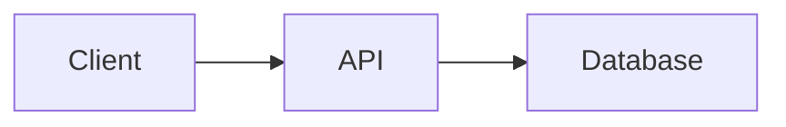
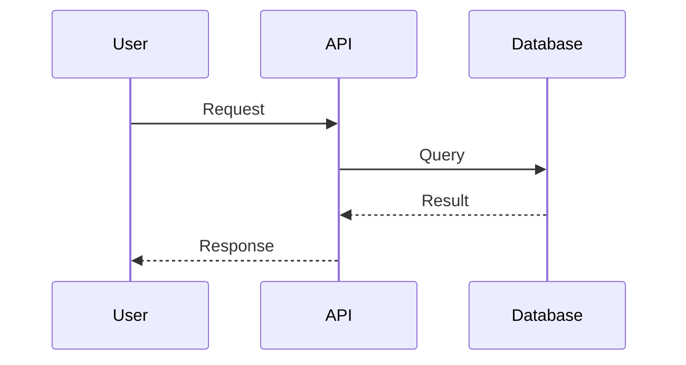

# Giz Code

<div align="center">


**AI-powered interactive documentation and learning platform for any codebase**

[](https://choosealicense.com/licenses/mit/)
[](https://nodejs.org/)
[](https://nextjs.org/)

[Demo](https://code.giz.ai) · [Documentation](https://github.com/GizAI/code/wiki) · [Report Bug](https://github.com/GizAI/code/issues)

</div>

---

## What is Giz Code?

Giz Code transforms any code repository into a beautiful, interactive learning experience. Just point it at your codebase, and it automatically:

- **Analyzes** your code structure with AI
- **Generates** comprehensive documentation
- **Creates** interactive diagrams (Mermaid)
- **Builds** a stunning documentation website

Perfect for onboarding new developers, creating internal docs, or open-source project documentation.

## Features

### Automatic Code Analysis
- Detects project structure, dependencies, and architecture
- Identifies key patterns and design decisions
- Maps relationships between components

### Beautiful Documentation
- MDX-powered content with React components
- Dark/Light theme with stunning aesthetics
- Responsive design for all devices

### Interactive Visualizations
- Mermaid diagrams auto-rendered from code
- Architecture flowcharts
- Sequence diagrams
- Entity relationship diagrams

### Zero Configuration
- Works with any JavaScript/TypeScript project
- Automatic file detection
- Smart content organization

## Quick Start

### Option 1: npx (Recommended)

```bash
npx giz-code init
npx giz-code dev
```

### Option 2: Clone & Install

```bash
# Clone the repository
git clone https://github.com/GizAI/code.git
cd code

# Install dependencies
npm install

# Start development server
npm run dev
```

Open [http://localhost:3000](http://localhost:3000) to see your documentation.

## Project Structure

```
giz-code/
├── content/           # Your MDX documentation files
│   ├── 00-getting-started.mdx
│   ├── 01-architecture.mdx
│   └── ...
├── src/
│   ├── app/           # Next.js App Router
│   ├── components/    # React components
│   │   ├── layout/    # Layout components
│   │   ├── mdx/       # MDX components
│   │   └── ui/        # UI primitives
│   └── lib/           # Utilities
├── scripts/           # CLI scripts
└── public/            # Static assets
```

## Writing Documentation

Create MDX files in the `content/` folder:

```mdx
---
title: Getting Started
description: Quick start guide for your project
icon: book
order: 0
---

# Getting Started

Your content here...

## Architecture



<Callout type="tip" title="Pro Tip">
  Use custom components for rich documentation!
</Callout>

<Grid cols={2}>
  <Feature icon="bolt" title="Fast">
    Built with Next.js 15 and Turbopack
  </Feature>
  <Feature icon="shield" title="Type Safe">
    Full TypeScript support
  </Feature>
</Grid>
```

## Available Components

| Component | Description |
|-----------|-------------|
| `<Card>` | Content container with optional glow effect |
| `<Callout>` | Info, warning, and tip callouts |
| `<Grid>` | Responsive grid layout (2-4 columns) |
| `<Feature>` | Feature card with icon |
| `<Steps>` | Step-by-step tutorial format |
| `<Terminal>` | Code block with terminal styling |
| `<Chip>` | Tag/badge component |

## Mermaid Diagrams

Giz Code automatically renders Mermaid diagrams from code blocks:

````markdown

````

Supported diagram types:
- Flowcharts
- Sequence diagrams
- Class diagrams
- Entity Relationship diagrams
- State diagrams
- Gantt charts
- And more...

## Themes

Giz Code includes two stunning themes:

### Noir (Dark)
- Deep blacks with lime accents
- Perfect for focused reading
- Atmospheric gradients

### Paper (Light)
- Warm paper tones
- Blue accent colors
- Easy on the eyes

Toggle themes with the sun/moon button in the header.

## Configuration

### next.config.ts

```typescript
const config = {
  // Add custom configuration here
};

export default config;
```

### Environment Variables

```bash
# .env.local
NEXT_PUBLIC_SITE_URL=https://your-domain.com
```

## Deployment

### Vercel (Recommended)

[](https://vercel.com/new/clone?repository-url=https://github.com/GizAI/code)

### Other Platforms

```bash
# Build for production
npm run build

# Start production server
npm start
```

## Contributing

Contributions are welcome! Please read our [Contributing Guide](CONTRIBUTING.md) first.

1. Fork the repository
2. Create your feature branch (`git checkout -b feature/amazing-feature`)
3. Commit your changes (`git commit -m 'Add amazing feature'`)
4. Push to the branch (`git push origin feature/amazing-feature`)
5. Open a Pull Request

## Roadmap

- [ ] AI-powered content generation
- [ ] GitHub integration for auto-sync
- [ ] Multiple language support
- [ ] Custom theme builder
- [ ] Plugin system
- [ ] VS Code extension

## License

MIT License - see [LICENSE](LICENSE) for details.

## Credits

Built with:
- [Next.js](https://nextjs.org/) - React framework
- [Tailwind CSS](https://tailwindcss.com/) - Styling
- [Framer Motion](https://www.framer.com/motion/) - Animations
- [Mermaid](https://mermaid.js.org/) - Diagrams
- [MDX](https://mdxjs.com/) - Markdown + JSX

---

<div align="center">
  <sub>Built with by <a href="https://github.com/GizAI">GizAI</a></sub>
</div>
