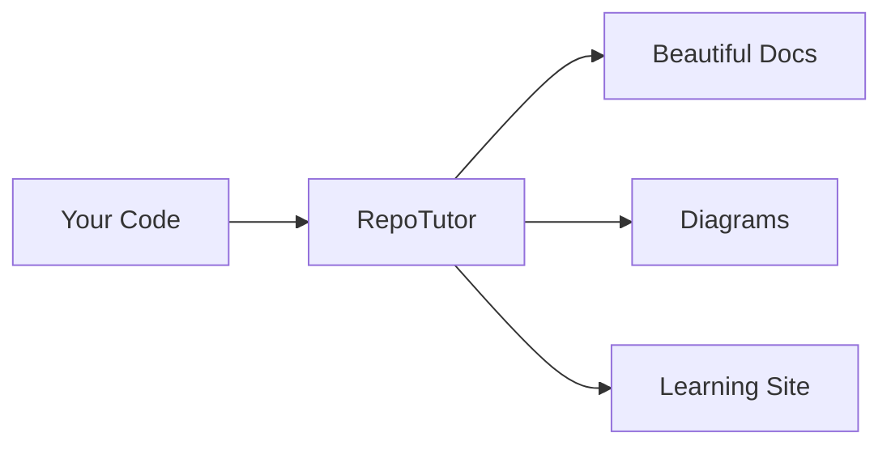

# Welcome to RepoTutor

RepoTutor transforms your codebase into beautiful, interactive documentation.



<Callout type="info" title="Quick Start">
  Add MDX files to the `content/` folder and they'll automatically appear in your documentation site.
</Callout>

## Features

<Grid cols={3}>
  <Feature icon="spark" title="AI Analysis">
    Automatically analyzes your codebase structure
  </Feature>
  <Feature icon="wires" title="Auto Diagrams">
    Mermaid diagrams render automatically
  </Feature>
  <Feature icon="layers" title="MDX Powered">
    Write docs with Markdown + React components
  </Feature>
</Grid>

## Getting Started

<Steps>
  <Step title="Install RepoTutor">
    ```bash
    npx repotutor init
    ```
  </Step>
  <Step title="Add Content">
    Create MDX files in the `content/` folder
  </Step>
  <Step title="Run Dev Server">
    ```bash
    npm run dev
    ```
  </Step>
</Steps>
