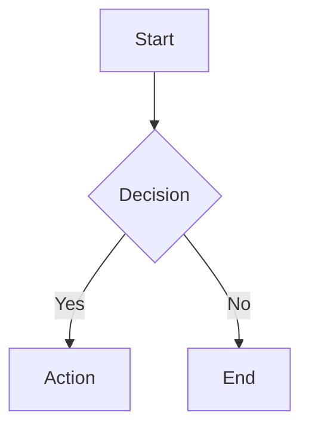

# Writing Documentation

RepoTutor uses MDX - Markdown with React components.

## Frontmatter

Every MDX file starts with frontmatter:

```yaml
---
title: Page Title
description: Brief description
icon: spark
order: 0
category: Category Name
---
```

## Available Icons

`spark` · `wires` · `shield` · `bolt` · `layers` · `code` · `book` · `globe` · `database` · `alert`

## Components

### Callout

<Callout type="info" title="Info">
  Use for general information
</Callout>

<Callout type="warning" title="Warning">
  Use for important warnings
</Callout>

<Callout type="tip" title="Tip">
  Use for helpful tips
</Callout>

### Grid & Feature

<Grid cols={2}>
  <Feature icon="bolt" title="Fast">
    Built with Next.js 15
  </Feature>
  <Feature icon="shield" title="Type Safe">
    Full TypeScript support
  </Feature>
</Grid>

### Steps

<Steps>
  <Step title="First Step">
    Description of the first step
  </Step>
  <Step title="Second Step">
    Description of the second step
  </Step>
</Steps>

### Mermaid Diagrams

````markdown

````

Renders as:


